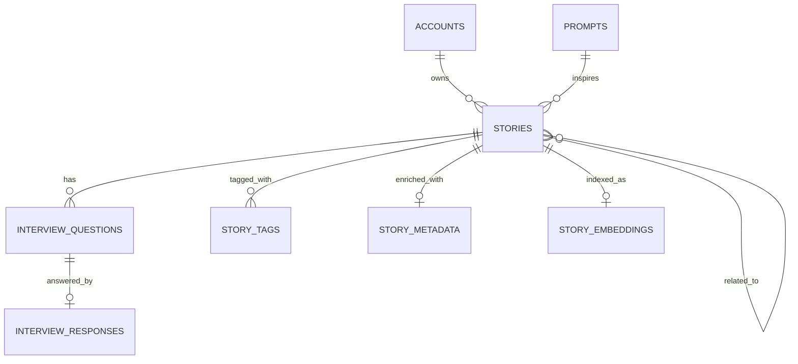

# Chronicle

**An AI-assisted public storytelling archive where lived experience becomes discoverable human knowledge.**

Chronicle helps people capture meaningful life stories, deepen them through AI-guided reflection, and publish them into a searchable story commons — a living archive of human experience organized by theme, meaning, and shared narrative rather than by identity or engagement metrics.

---

## Why Chronicle?

A great deal of human wisdom is lost because people don't consistently document their experiences, and existing platforms are poorly suited to preserving thoughtful narrative. Journals stay private and unsearchable. Social media optimizes for speed and reaction over reflection. Voice notes remain unstructured.

Chronicle exists in the space between — a platform that treats stories as **knowledge-bearing artifacts** rather than disposable posts, and where AI serves as a thoughtful collaborator in the storytelling process rather than a replacement for the storyteller's voice.

### Core Principles

- **Story-first, not profile-first** — published stories stand on their own merit without author attribution
- **AI assists, never replaces** — reflection questions deepen the narrative; the user's voice stays primary
- **Preservation over engagement** — the archive rewards curiosity and reflection, not compulsive scrolling
- **Discovery by meaning** — semantic search connects stories through shared experience, not just keywords

---

## Architecture

Chronicle is built as a **modular monolith** — a single cohesive application with strong internal boundaries between domains, designed for iterative solo development while preserving clean separation of concerns.

```
┌─────────────────────────────────────────────────────────────────┐
│                      Next.js Application                        │
│                                                                 │
│  ┌──────────────┐  ┌──────────────┐  ┌────────────────────────┐ │
│  │   Identity    │  │    Story     │  │    AI Interview        │ │
│  │   & Access    │  │  Authoring   │  │    Module              │ │
│  │   Module      │  │   Module     │  │  (Follow-up Questions) │ │
│  └──────────────┘  └──────────────┘  └────────────────────────┘ │
│  ┌──────────────┐  ┌──────────────┐  ┌────────────────────────┐ │
│  │ Publication   │  │  Discovery   │  │   Metadata &           │ │
│  │ & Archive     │  │   Module     │  │   Enrichment Module    │ │
│  │  Module       │  │  (Search)    │  │  (Themes, Tags, etc.)  │ │
│  └──────────────┘  └──────────────┘  └────────────────────────┘ │
│  ┌─────────────────────────────────────────────────────────────┐ │
│  │              Background Jobs (Async Enrichment)             │ │
│  └─────────────────────────────────────────────────────────────┘ │
└───────────────────────────┬─────────────────────────────────────┘
                            │
            ┌───────────────┼───────────────┐
            ▼               ▼               ▼
   ┌────────────────┐ ┌──────────┐ ┌──────────────────┐
   │  PostgreSQL    │ │ pgvector │ │  OpenAI API      │
   │  (System of    │ │ (Semantic│ │  (LLM Provider   │
   │   Record)      │ │  Index)  │ │   Abstraction)   │
   └────────────────┘ └──────────┘ └──────────────────┘
```

### Key Architectural Decisions

| Decision | Rationale |
|---|---|
| **Modular monolith** | Simplifies deployment and local development while maintaining clean internal boundaries |
| **Server actions over REST API** | Leverages Next.js App Router for type-safe, colocated backend logic |
| **pgvector for semantic search** | Keeps vector retrieval in the primary database, avoiding premature infrastructure complexity |
| **Provider abstraction for AI** | Centralizes prompt templates and enables provider swaps without touching domain code |
| **Async enrichment pipeline** | Publication stays fast; embedding generation and metadata extraction run in background jobs |
| **Private ownership, public non-attribution** | Story ownership is enforced server-side but never leaked through archive APIs or UI |

---

## Tech Stack

| Layer | Technology |
|---|---|
| **Framework** | [Next.js 15](https://nextjs.org/) (App Router, Server Actions) |
| **Language** | TypeScript |
| **Database** | PostgreSQL |
| **ORM** | [Drizzle ORM](https://orm.drizzle.team/) |
| **Vector Search** | [pgvector](https://github.com/pgvector/pgvector) |
| **Authentication** | [Auth.js](https://authjs.dev/) (NextAuth v5) |
| **AI Integration** | OpenAI API (behind internal abstraction layer) |
| **Styling** | CSS Modules |

---

## Data Model

The domain model is centered on the **Story** as the primary unit of value, with supporting entities for AI-assisted refinement and semantic discovery:



**Story lifecycle:** `Draft` → `Published` → `Unpublished` | `Deleted`

- **Drafts** are private, editable, and invisible to the archive
- **Published** stories enter the searchable commons with AI-extracted metadata
- **Unpublished** stories are retained privately but removed from discovery
- Story ownership is enforced at the data layer but never exposed publicly

---

## Features

### Implemented
- ✅ Account registration and authentication (email/password)
- ✅ Story creation and draft persistence
- ✅ AI-assisted interview flow (contextual follow-up questions via OpenAI)
- ✅ Story review, editing, and finalization
- ✅ Publication lifecycle management (publish / unpublish / delete)
- ✅ Public story archive with anonymous, non-attributed browsing
- ✅ Semantic search via pgvector embeddings
- ✅ AI-generated metadata extraction (themes, time period, life stage, emotional tone)
- ✅ Story tagging system
- ✅ Related story discovery via embedding similarity
- ✅ Community prompts for thematic storytelling
- ✅ Background job processing for async enrichment
- ✅ Private author dashboard for story management

### Planned
- 🔲 Prompt-based archive browsing and thematic collections
- 🔲 Hybrid retrieval ranking (keyword + semantic + metadata signals)
- 🔲 PII minimization guidance and pre-publish review nudges
- 🔲 Voice/audio story input
- 🔲 Story export and legacy preservation features

---

## Getting Started

### Prerequisites

- **Node.js** ≥ 18
- **PostgreSQL** ≥ 15 with the [pgvector](https://github.com/pgvector/pgvector) extension
- **OpenAI API key**

### Setup

```bash
# Clone the repository
git clone https://github.com/nilomadison/chronicle.git
cd chronicle

# Install dependencies
npm install

# Configure environment
cp .env.local.example .env.local
# Edit .env.local with your database URL, auth secret, and OpenAI key

# Run database migrations
npm run db:migrate

# Seed initial data (community prompts)
npm run db:seed

# Start the development server
npm run dev
```

The application will be available at `http://localhost:3000`.

### Environment Variables

| Variable | Description |
|---|---|
| `DATABASE_URL` | PostgreSQL connection string |
| `AUTH_SECRET` | Secret for Auth.js session encryption (generate with `openssl rand -base64 32`) |
| `AUTH_URL` | Application URL for auth callbacks |
| `OPENAI_API_KEY` | OpenAI API key for AI interview and embedding features |

---

## Project Structure

```
chronicle/
├── docs/                    # Product vision, domain model, architecture docs
├── scripts/                 # Utility scripts (test seeding, etc.)
├── src/
│   ├── actions/             # Server actions (auth, stories, interview, publication, search, archive)
│   ├── app/
│   │   ├── (auth)/          # Login and registration routes
│   │   ├── (protected)/     # Authenticated routes
│   │   │   ├── archive/     # Public story archive and reading
│   │   │   ├── dashboard/   # Personal story management
│   │   │   └── stories/     # Story creation and editing
│   │   └── api/             # API routes
│   ├── components/          # React components (UI primitives, story components)
│   ├── db/                  # Database client, schema (Drizzle ORM), seeds
│   └── lib/
│       ├── ai/              # AI provider abstraction and prompt templates
│       ├── auth.ts          # Auth.js configuration
│       ├── domain/          # Domain logic and business rules
│       └── jobs/            # Background job processing
└── drizzle.config.ts        # Drizzle Kit configuration
```

---

## Documentation

The `docs/` directory contains the full product planning and design documentation:

| Document | Description |
|---|---|
| [North Star](docs/chronicle_north_star_draft.md) | Product vision, principles, and success criteria |
| [MVP Scope & Features](docs/chronicle_mvp_scope_and_feature_definition_draft.md) | Concrete feature set and product boundaries |
| [Core User Flows](docs/chronicle_mvp_core_user_flows.md) | End-to-end user journeys with privacy analysis |
| [Domain Model](docs/chronicle_domain_model_draft.md) | Entity definitions, relationships, and domain rules |
| [System Architecture](docs/chronicle_system_architecture_draft.md) | Technical architecture, module design, and deployment strategy |
